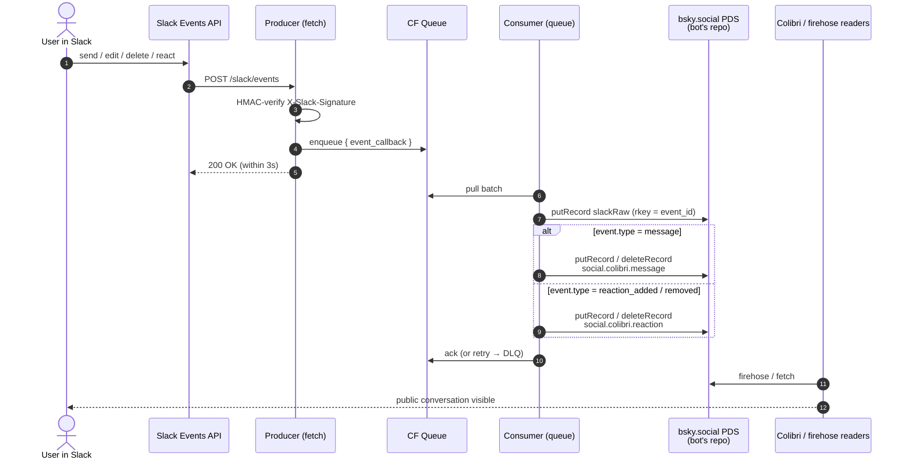

> **Status:** v0 forward path live since 2026-05-31. Bot identity [`@feelingofcomputing.bsky.social`](https://bsky.app/profile/feelingofcomputing.bsky.social) (`did:plc:4gcxakknd6hxtnhf33miwsob`). Community owned by a separate identity (`did:plc:j7nm3lrd5h7fm3sfhcv3lhfv`). Auto-deployed on push.

One-way sync from the FoC Slack workspace into the [Colibri](https://colibri.social) atproto network. Every bridged message, reaction, and attachment is a public record on the bot's bsky.social PDS; every raw Slack event is archived losslessly under a `com.feelingofcomputing.bridge.*` lexicon on the same repo. The bot authors messages into channels owned by a separate community-owner DID — the *inverse pattern* described under [Identity](#identity).

## What's live

Forward path (Slack → atproto), end-to-end:

- **Messages** — rich text → Colibri facets (bold, italic, strikethrough, code, link, channel); 2048-char cap; fallback to plain-text + URL regex for legacy non-`blocks` messages
- **Mentions** — `@user` resolves to a `social.colibri.richtext.facet#mention` against the user's claimed DID via the [in-source map](https://github.com/tomlarkworthy/slack-sync/blob/main/packages/worker/src/slack-to-did.ts); plain text fallback for unmapped users
- **Threaded replies** — Slack `thread_ts` → Colibri `parent`
- **Reactions** add + remove — deterministic per-emoji rkey on the target message
- **Message edits** — re-derive in place, `putRecord` overwrites, `edited: true` set per the message lexicon
- **Message deletes** — `deleteRecord` on the derived rkey
- **File attachments** — fetch `url_private` with bot token → `com.atproto.repo.uploadBlob` → reference in `attachments[]`; 5 MB cap, oversize gets a `[file 'name' too large]` placeholder in the message text
- **Lossless raw-event archive** — every `event_callback` envelope persisted to `com.feelingofcomputing.bridge.slackRaw` *before* derivation, keyed by `event_id` (idempotent on Slack redelivery)

Out of scope for v0:

- Reverse path (Colibri → Slack)
- Private channels, DMs
- Claim flow + posting from claimed DID (v2 below)
- `slackOrigin` / `slackChannel` / `slackUser` records — lexicons defined below but the v0 worker uses in-source maps instead, accepted trade-off at FoC scale
- `slackRaw` backfill — only new traffic from 2026-05-31 onward is archived; historical days have derived `social.colibri.message` + `social.colibri.reaction` only

## Code

- **Repo**: [tomlarkworthy/slack-sync](https://github.com/tomlarkworthy/slack-sync) — Bun workspace monorepo
- **Worker**: [`packages/worker/src/index.ts`](https://github.com/tomlarkworthy/slack-sync/blob/main/packages/worker/src/index.ts) — single Cloudflare Worker; producer (`fetch`) + consumer (`queue`) in one script
- **Backfill**: [`packages/backfill/src/index.ts`](https://github.com/tomlarkworthy/slack-sync/blob/main/packages/backfill/src/index.ts) — Bun CLI for re-publishing day-files from [Mariano's archive](https://github.com/marianoguerra/Feeling-of-Computing)
- **Slack app manifest**: [`manifest/slack-app.yaml`](https://github.com/tomlarkworthy/slack-sync/blob/main/manifest/slack-app.yaml)
- **Deploy**: Cloudflare Workers Builds, push-to-main → auto-deploy

## Architecture



Notes on the live shape vs. the proposal that preceded it:

- **No D1 cache in v0.** The worker writes straight to the PDS and leans on deterministic rkeys + `putRecord` overwrite for idempotency. The D1 binding is reserved in `wrangler.toml` for v0.1+ if cache reads become useful.
- **slackRaw is the de-facto idempotency boundary.** rkey = sanitised Slack `event_id`; Slack redeliveries hit the same rkey and overwrite identical content.
- **Message rkey** = `tidFromSlackTs(message.ts)` — edits overwrite in place, deletes target the same rkey.
- **Reaction rkey** = `tidFromSlackTs(target.ts, hash10('react:' + emoji))` — same emoji on the same message always lands on the same record, so `reaction_removed` can `deleteRecord` without lookup.

## Lexicons

### Reused from Colibri

- [`social.colibri.message`](https://lexicon.garden/browse/social.colibri.message) — text, facets, createdAt, channel, parent, attachments, edited
- [`social.colibri.reaction`](https://lexicon.garden/browse/social.colibri.reaction) — emoji, targetMessage
- [`social.colibri.richtext.facet`](https://lexicon.garden/browse/social.colibri.richtext.facet) — bold, italic, strikethrough, code, link, mention, channel

### Owned: `com.feelingofcomputing.bridge.*`

Namespace owned because FoC owns `feelingofcomputing.com/.org/.net`. The archive's lifetime, schema, and ownership belong to FoC, not Colibri — explicit boundary in the lexicon namespace de-risks Colibri lexicon churn (it has a substantial rework in flight on `feat/rework`) and de-risks Colibri disappearing entirely. If either happens, the raw archive on atproto is untouched and re-derivable.

#### Live in v0: `com.feelingofcomputing.bridge.slackRaw`

Lossless capture of the full `event_callback` envelope, written *before* any derivation.

```json
{
  "lexicon": 1,
  "id": "com.feelingofcomputing.bridge.slackRaw",
  "defs": {
    "main": {
      "type": "record",
      "key": "any",
      "record": {
        "type": "object",
        "required": ["slackChannelId", "slackTs", "payload", "capturedAt"],
        "properties": {
          "slackChannelId": { "type": "string" },
          "slackTs":        { "type": "string" },
          "eventType":      { "type": "string", "description": "Slack event type: message, message_changed, message_deleted, reaction_added, reaction_removed, etc." },
          "payload":        { "type": "unknown", "description": "Raw Slack event_callback envelope as received." },
          "capturedAt":     { "type": "string", "format": "datetime" }
        }
      }
    }
  }
}
```

rkey = sanitised Slack `event_id`. Slack file attachments referenced in `payload.files[]` are captured by URL only; the bytes are re-uploaded as atproto blobs by the derived `social.colibri.message` path (see [Code → Worker](https://github.com/tomlarkworthy/slack-sync/blob/main/packages/worker/src/index.ts)).

#### Designed for v0.1: `slackOrigin`, `slackChannel`, `slackUser`

These three lexicons appear in the design but are **not written by v0**. The worker uses in-source maps (`CHANNEL_MAP` and `SLACK_USER_DID_MAP` in [`packages/worker/src/`](https://github.com/tomlarkworthy/slack-sync/blob/main/packages/worker/src/)) — requires a redeploy on changes but is sufficient at FoC scale (~10 channels, ~15 mapped users). The lexicons below are the spec for when in-source maps stop scaling.

##### `com.feelingofcomputing.bridge.slackOrigin`

Provenance + dedupe authority. One-to-one with a `social.colibri.message`. `key: "any"` so the rkey is deterministic from Slack identifiers.

```json
{
  "lexicon": 1,
  "id": "com.feelingofcomputing.bridge.slackOrigin",
  "defs": {
    "main": {
      "type": "record",
      "key": "any",
      "record": {
        "type": "object",
        "required": ["messageUri", "slackChannelId", "slackTs", "createdAt"],
        "properties": {
          "messageUri":     { "type": "string", "format": "at-uri" },
          "slackChannelId": { "type": "string" },
          "slackTs":        { "type": "string" },
          "slackUserId":    { "type": "string" },
          "createdAt":      { "type": "string", "format": "datetime" }
        }
      }
    }
  }
}
```

##### `com.feelingofcomputing.bridge.slackChannel`

Slack channel ID → Colibri channel at-uri mapping. Rkey = Slack channel ID.

```json
{
  "lexicon": 1,
  "id": "com.feelingofcomputing.bridge.slackChannel",
  "defs": {
    "main": {
      "type": "record",
      "key": "any",
      "record": {
        "type": "object",
        "required": ["slackChannelId", "colibriChannelUri", "createdAt"],
        "properties": {
          "slackChannelId":    { "type": "string" },
          "slackChannelName":  { "type": "string" },
          "colibriChannelUri": { "type": "string", "format": "at-uri" },
          "createdAt":         { "type": "string", "format": "datetime" }
        }
      }
    }
  }
}
```

##### `com.feelingofcomputing.bridge.slackUser`

Identity record. Rkey = sanitised Slack user ID. `claimedDid` starts unset; populated via the claim flow when that lands. OAuth credentials (v2) never go on atproto.

```json
{
  "lexicon": 1,
  "id": "com.feelingofcomputing.bridge.slackUser",
  "defs": {
    "main": {
      "type": "record",
      "key": "any",
      "record": {
        "type": "object",
        "required": ["slackUserId", "createdAt"],
        "properties": {
          "slackUserId": { "type": "string" },
          "slackHandle": { "type": "string" },
          "displayName": { "type": "string" },
          "claimedDid":  { "type": "string", "format": "did" },
          "claimedAt":   { "type": "string", "format": "datetime" },
          "createdAt":   { "type": "string", "format": "datetime" }
        }
      }
    }
  }
}
```

## Identity

Two DIDs are involved:

- **Community owner** (`did:plc:j7nm3lrd5h7fm3sfhcv3lhfv`) owns the [Feeling of Computing community](https://colibri.social) and every category + channel under it.
- **Bot** (`did:plc:4gcxakknd6hxtnhf33miwsob`, handle `feelingofcomputing.bsky.social`) is a member with a `social.colibri.membership` record; it authors every bridged message into channels owned by the community owner.

Attribution for the original Slack speaker lives in the message text as `@user: ...` — rendered as a Colibri mention facet once the speaker has claimed a DID.

### Authorship is immutable

The author of an atproto record is the DID of the repo it lives on. `putRecord` edits content; `deleteRecord` removes a record; nothing reassigns authorship. Consequences:

- All bridged messages stay authored by the bot. Forever.
- Posting from the user's own DID (v2 below) only applies to *new* messages after claim. Hybrid history.
- Retroactive delete + republish would change the at-uri, breaking links, threads, firehose state. Not recommended.

### Channels live in the bot's community

The Colibri appview hard-couples channel ownership to community ownership by author DID. From `jetstream.rs`:

```rust
let community_uri =
    format!("at://{}/social.colibri.community/{}", did, record.community);
```

The community URI for an indexed channel is constructed from the **channel record's author DID** plus the channel's `community` rkey field. A bot-authored channel record can only resolve to a community on the bot's own repo; the appview will not index a bot-authored channel into a community owned by a different DID.

v0 went with the **inverse pattern**: the community owner pre-creates the community + every bridged channel under their own DID; the bot only authors messages referencing the channel rkeys. The bot does *not* own the community, channels, or categories. Trade-off: one-time manual setup by the community owner and an ongoing convention that they add a Colibri channel whenever a new Slack channel should be bridged — but the bot's repo stays a pure archival identity, and ownership of the community is decoupled from the bridge's operational lifetime (we could replace the bot identity tomorrow without affecting the community).

### Per-message avatar / displayName

Avatar and displayName come from the actor's profile record — one per DID. With one bot DID, every bridged message renders with the bot's avatar. The Colibri message lexicon has no override fields. Per-user ghost DIDs (Bridgy Fed's approach) would solve this but we reject them for v0/v1: bsky.social account-creation rate limits, and creating DIDs for users without consent.

Single biggest UX gap. See *What would improve v0 next* below.

### Claim flow (designed, not in v0)

A user posts `I am did:plc:...` in any bridged Slack channel. The bridge extracts the DID and writes it to the `slackUser.claimedDid` atproto record. No cryptographic verification in v1 — posting from their Slack account is the trust signal, and the claim is publicly visible for anyone to challenge.

v2 requires a counter-claim record on the claimed DID's repo, verifiable from atproto alone.

### Posting from the claimed DID (v2)

Once `claimedDid` is set, future messages could be authored from the user's DID via atproto OAuth (not Bluesky app-passwords — those are a bsky.social UX, not portable across PDSes). Refresh tokens medium-lived; bridge re-prompts via Slack DM near expiry. Tokens live in a private D1 table, encrypted at rest, never on atproto.

## What would improve v0 next

Upstream changes the bridge benefits from. Until they land, `slackRaw` preserves enough state to re-derive when they do.

- **Per-record author override** on `social.colibri.message` and `social.colibri.reaction` — optional `displayAuthor: { name, avatar? }`. Without it every bridged message and every aggregated reaction renders as the bot. Single biggest UX win; unblocks proper reaction multi-reactor counts too.
- **Collapsed / nested thread rendering** — Colibri's UI is Discourse-flat today. A 30-reply Slack thread becomes 30 sibling rows in the channel scroll. `feat/rework` still renders flat with `parent_message` as a jump-link.
- **Cross-repo channel ownership** — the appview hard-codes `community_uri = at://{channel_author}/social.colibri.community/{rkey}`. Workaround we used is "community owner pre-creates channels under their own DID, bot authors messages referencing those channel rkeys" (the inverse pattern). Works but requires manual coordination on every new bridged channel. Cleaner: a `communityRepo` field on `social.colibri.channel`, or a `social.colibri.delegation` record granting channel-creation to a DID.
- **Quote facet feature** — Slack `rich_text_quote` blocks render as `> `-prefixed plain text since Colibri's facet set lacks quote.
- **TID-on-rkey monotonicity assurance** — `social.colibri.message` uses `key: "tid"`. bsky.social tolerates non-monotonic TIDs (otherwise backfill of old Slack history would 409 against live messages). A PDS that strictly enforces monotonicity would break the bridge. Worth a one-line "we don't require monotonic rkeys" assurance in the lexicon docs, or a switch to `key: "any"`.
- **Lexicon publication** — `com.feelingofcomputing.bridge.*` records currently show "not validated" in atproto-browser. Needs `_lexicon` resolution on `feelingofcomputing.com` or `com.atproto.lexicon.schema` records to publish.

## Open

- **Backfill cadence** — the [archive submodule](https://github.com/marianoguerra/Feeling-of-Computing) updates weekly. There's a 20-day gap between the archive's last day and the live bridge cutover (2026-05-31). Waiting for the next dump before backfilling so the bridged record is gap-free.
- **False DID claims** — v1 unverified; v2 requires two-sided counter-claim.
- **OAuth re-auth UX** (v2) — frequency cap, fallback when user ignores the prompt.

## Prior art

- **[Bridgy Fed](https://fed.brid.gy)** — ActivityPub ↔ atproto. Not directly applicable (Slack isn't ActivityPub) but informs the rejected per-user ghost-DID approach.
- **[matrix-appservice-slack](https://github.com/matrix-org/matrix-appservice-slack)** — closest sibling. Same Slack-webhook → ghost-users → federated-protocol shape, targeting Matrix.
- **Mariano's `scripts/dump-history.js` + `foc-server`** ([repo](https://github.com/marianoguerra/Feeling-of-Computing)) — the existing FoC pipeline pulls `conversations.history` + `conversations.replies` via Slack REST on a weekly cadence, writes JSON to `history/YYYY/MM/DD{,.replies}.json`, indexes into LanceDB with sentence-transformer embeddings, serves search via a Rust `axum` binary on Ubuntu under systemd behind nginx. Pull, not push; ingest-and-reindex, not bridge. The bridge's `slackRaw` lexicon is the atproto-native analog of those `history/*.json` dumps — same archival role, public over the firehose instead of `git push`. The backfill CLI consumes these JSON dumps directly.

## Related

- [[Projects]] — Colibri and FoC are both listed.
- [Colibri lexicons](https://lexicon.garden/browse/social.colibri)
- [Colibri source](https://github.com/colibri-social/colibri.social)
- [FoC repo](https://github.com/marianoguerra/Feeling-of-Computing)
