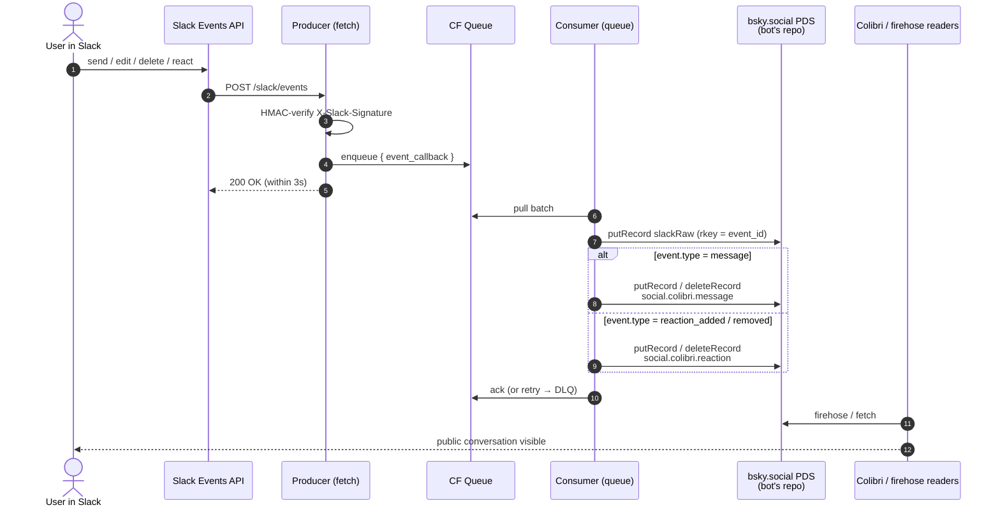

> **Status:** v0 forward path (Slack → Colibri) live since 2026-05-31. Reverse path (Colibri → Slack) proposed 2026-09-07, not built — see [Reverse path](#reverse-path-colibri--slack-proposed). Bot identity [`@feelingofcomputing.bsky.social`](https://bsky.app/profile/feelingofcomputing.bsky.social) (`did:plc:4gcxakknd6hxtnhf33miwsob`). The community migrated on 2026-08-12 to its own identity `did:plc:dl3d3fftr4tk3yf3xqxouus7` on `colibri.social`; the bridge still writes the pre-migration channel rkeys, which Colibri resolves through `migratedFrom`. Auto-deployed on push.

One-way sync from the FoC Slack workspace into the [Colibri](https://colibri.social) atproto network. Every bridged message, reaction, and attachment is a public record on the bot's bsky.social PDS; every raw Slack event is archived losslessly under a `com.feelingofcomputing.bridge.*` lexicon on the same repo. The bot authors messages into channels it does not own — the *inverse pattern* described under [Identity](#identity).

## What's live

Forward path (Slack → atproto), end-to-end:

- **Messages** — rich text → Colibri facets (bold, italic, strikethrough, code, link, channel); 2048-char cap; fallback to plain-text + URL regex for legacy non-`blocks` messages
- **Mentions** — `@user` resolves to a `social.colibri.richtext.facet#mention` against the user's claimed DID via the [in-source map](https://github.com/tomlarkworthy/slack-sync/blob/main/packages/worker/src/slack-to-did.ts); plain text fallback for unmapped users
- **Threaded replies** — Slack `thread_ts` → Colibri `parent`
- **Reactions** add + remove — deterministic per-emoji rkey on the target message. Since [`d757ec5`](https://github.com/tomlarkworthy/slack-sync/commit/d757ec5) (2026-09-07) written with the `parent` at-uri Colibri's lexicon requires; the 598 records before it carry only the older `targetMessage` field and do not render until rewritten; see [Known gaps](#known-gaps)
- **Message edits** — re-derive in place, `putRecord` overwrites, `edited: true` set per the message lexicon
- **Message deletes** — `deleteRecord` on the derived rkey
- **File attachments** — fetch `url_private` with bot token → `com.atproto.repo.uploadBlob` → reference in `attachments[]`; 5 MB cap, oversize gets a `[file 'name' too large]` placeholder in the message text
- **Lossless raw-event archive** — every `event_callback` envelope persisted to `com.feelingofcomputing.bridge.slackRaw` *before* derivation, keyed by `event_id` (idempotent on Slack redelivery)

Not in scope:

- Reverse path (Colibri → Slack) — proposed below, not built
- Private channels, DMs
- Per-Slack-user authorship — every bridged record is authored by the bot; the original speaker appears as `@user:` in the message text
- `slackRaw` backfill — historical days (pre-2026-05-31) have derived `social.colibri.message` + `social.colibri.reaction` only; the raw archive only exists for traffic the live bridge has seen

## Code

- **Repo**: [tomlarkworthy/slack-sync](https://github.com/tomlarkworthy/slack-sync) — Bun workspace monorepo
- **Worker**: [`packages/worker/src/index.ts`](https://github.com/tomlarkworthy/slack-sync/blob/main/packages/worker/src/index.ts) — single Cloudflare Worker; producer (`fetch`) + consumer (`queue`) in one script
- **Backfill**: [`packages/backfill/src/index.ts`](https://github.com/tomlarkworthy/slack-sync/blob/main/packages/backfill/src/index.ts) — Bun CLI for re-publishing day-files from [Mariano's archive](https://github.com/marianoguerra/Feeling-of-Computing)
- **Slack app manifest**: [`manifest/slack-app.yaml`](https://github.com/tomlarkworthy/slack-sync/blob/main/manifest/slack-app.yaml)
- **Deploy**: Cloudflare Workers Builds, push-to-main → auto-deploy

## Architecture



Notes on the live shape vs. the proposal that preceded it:

- **No D1 cache in v0.** The worker writes straight to the PDS and leans on deterministic rkeys + `putRecord` overwrite for idempotency. The D1 binding is reserved in `wrangler.toml` for v0.1+ if cache reads become useful.
- **slackRaw is the de-facto idempotency boundary.** rkey = sanitised Slack `event_id`; Slack redeliveries hit the same rkey and overwrite identical content.
- **Message rkey** = `tidFromSlackTs(message.ts)` — edits overwrite in place, deletes target the same rkey. The Slack timestamp is recoverable from the rkey (`tid >> 10` is Slack microseconds), which the reverse path relies on.
- **Reaction rkey** = `tidFromSlackTs(target.ts, hash10('react:' + emoji))` — same emoji on the same message always lands on the same record, so `reaction_removed` can `deleteRecord` without lookup.

## Lexicons

### Reused from Colibri

- [`social.colibri.message`](https://lexicon.garden/browse/social.colibri.message) — text, facets, createdAt, channel, parent, attachments, edited
- [`social.colibri.reaction`](https://lexicon.garden/browse/social.colibri.reaction) — emoji, targetMessage
- [`social.colibri.richtext.facet`](https://lexicon.garden/browse/social.colibri.richtext.facet) — bold, italic, strikethrough, code, link, mention, channel

The bridge writes `channel`, `parent` and `targetMessage` as bare rkeys. The current Colibri client writes at-uris, and names a reaction's target `parent`. See [Known gaps](#known-gaps) for the observed shapes side by side.

### Owned: `com.feelingofcomputing.bridge.*`

Namespace owned because FoC owns `feelingofcomputing.com/.org/.net`. The archive's lifetime, schema, and ownership belong to FoC, not Colibri — explicit boundary in the lexicon namespace de-risks Colibri lexicon churn (it has a substantial rework in flight on `feat/rework`) and de-risks Colibri disappearing entirely. If either happens, the raw archive on atproto is untouched and re-derivable.

#### Live in v0: `com.feelingofcomputing.bridge.slackRaw`

Lossless capture of the full `event_callback` envelope, written *before* any derivation.

```json
{
  "lexicon": 1,
  "id": "com.feelingofcomputing.bridge.slackRaw",
  "defs": {
    "main": {
      "type": "record",
      "key": "any",
      "record": {
        "type": "object",
        "required": ["slackChannelId", "slackTs", "payload", "capturedAt"],
        "properties": {
          "slackChannelId": { "type": "string" },
          "slackTs":        { "type": "string" },
          "eventType":      { "type": "string", "description": "Slack event type: message, message_changed, message_deleted, reaction_added, reaction_removed, etc." },
          "payload":        { "type": "unknown", "description": "Raw Slack event_callback envelope as received." },
          "capturedAt":     { "type": "string", "format": "datetime" }
        }
      }
    }
  }
}
```

rkey = sanitised Slack `event_id`. Slack file attachments referenced in `payload.files[]` are captured by URL only; the bytes are re-uploaded as atproto blobs by the derived `social.colibri.message` path (see [Code → Worker](https://github.com/tomlarkworthy/slack-sync/blob/main/packages/worker/src/index.ts)).

## Maintenance

The bridge's per-deployment configuration lives in source, not in lexicon records. Two maps:

- **Slack channel → Colibri channel rkey** — `packages/worker/src/index.ts` (constant `CHANNEL_MAP`) for the live worker, and `tools/slack-to-colibri-channel.json` for the backfill CLI. The two must agree.
- **Slack user id → claimed atproto DID** — [`packages/worker/src/slack-to-did.ts`](https://github.com/tomlarkworthy/slack-sync/blob/main/packages/worker/src/slack-to-did.ts) for the live worker, `tools/slack-to-did.json` for the backfill. The two must agree.

Since the 2026-08-12 migration every channel has two rkeys. `CHANNEL_MAP` still holds the pre-migration ones; the migrated channel records carry `migratedFrom` pointing back at them. Read from `did:plc:dl3d3fftr4tk3yf3xqxouus7` on 2026-09-07:

```
Slack id      name                pre-migration rkey       migrated rkey
              (owner did:plc:j7nm3lrd5h7fm3sfhcv3lhfv)     (did:plc:dl3d3fftr4tk3yf3xqxouus7)
CGMJ7323Z     announcements       3mn5tjsyuvt2t            3msvih7djjrdp
C01932BJGE8   present-company     3mn5tlwafrh2k            3msvih7djjqmu
C5U3SEW6A     linking-together    3mn5tle5l7c2z            3msvih7djjpb2
CEXED56UR     administrivia       3mn5tjjdnai2t            3msvih7djjo7j
C050QK4917D   of-ai               3mn5tlntcfa2f            3msvih7djjm5k
C5T9GPWFL     thinking-together   3mn5tmllqd72d            3msvih7djjlku
C0B7BGKT8MP   test-01             3mn5tckh3ij24            3msvih7djjklu
C03RR0W5DGC   devlog-together     3mn5tk5v4yr2s            3msvih7djji3e
C0120A3L30R   two-minute-week     3mn5tn53kwy2w            3msvih7djjha6
CC2JRGVLK     introduce-yourself  3mn5tkvfo2j2s            3msvih7djjfxt
CCL5VVBAN     share-your-work     3mn5tmbyexz27            3msvih7djjbh2
```

To add a new bridged channel: create the `social.colibri.channel` record on the community identity, hand the rkey to the bridge maintainer, who edits both files, commits, and pushes — Cloudflare Workers Builds redeploys the worker automatically on push. A channel created after the migration has only a migrated-style rkey; whether the bot may reference it as a bare rkey or must use the at-uri form is untested.

To map a new user to their DID: get their bsky handle, resolve to a DID with `com.atproto.identity.resolveHandle`, add the entry to both files, commit, push.

## Identity

Three DIDs are involved since the migration:

- **Original community owner** (`did:plc:j7nm3lrd5h7fm3sfhcv3lhfv`) created the community (`social.colibri.community/3mn5nudqvhs2x`) and every channel under it on 2026-05-31. That community record now carries `migratedTo`.
- **Community identity** (`did:plc:dl3d3fftr4tk3yf3xqxouus7`, handle `c-3msvih5zj4kuk.colibri.social`, PDS `colibri.social`) holds the community as `social.colibri.community/self` with `migratedFrom`, `appview: did:web:api.colibri.social`, and 11 channels each with `migratedFrom`. Created 2026-08-12 (the TIDs decode to 15:54 UTC that day).
- **Bot** (`did:plc:4gcxakknd6hxtnhf33miwsob`, handle `feelingofcomputing.bsky.social`) authors every bridged message. Its `social.colibri.membership` record still names the original community URI; the bridged messages render in the migrated community regardless, so either the appview follows `migratedFrom` for membership too or membership is not enforced for writes. Not verified which.

Attribution for the original Slack speaker lives in the message text as `@user: ...` — rendered as a Colibri mention facet once the speaker has claimed a DID.

### Authorship is immutable

The author of an atproto record is the DID of the repo it lives on. `putRecord` edits content; `deleteRecord` removes a record; nothing reassigns authorship. All bridged messages stay authored by the bot. Retroactive delete + republish would change the at-uri, breaking links, threads, and firehose state, so we don't.

### Channels live in the bot's community

The Colibri appview, as read in May 2026, hard-coupled channel ownership to community ownership by author DID. From `jetstream.rs`:

```rust
let community_uri =
    format!("at://{}/social.colibri.community/{}", did, record.community);
```

The community URI for an indexed channel is constructed from the **channel record's author DID** plus the channel's `community` rkey field. A bot-authored channel record can only resolve to a community on the bot's own repo; the appview will not index a bot-authored channel into a community owned by a different DID.

v0 went with the **inverse pattern**: the community owner pre-creates the community + every bridged channel under their own DID; the bot only authors messages referencing the channel rkeys. The bot does *not* own the community, channels, or categories. Trade-off: one-time manual setup by the community owner and an ongoing convention that they add a Colibri channel whenever a new Slack channel should be bridged — but the bot's repo stays a pure archival identity, and ownership of the community is decoupled from the bridge's operational lifetime.

The migration moved the community onto a DID of its own rather than a person's. That is a different answer to the same coupling: the community identity owns its channels, and people (and the bot) write into them. Observed from the records, not from the appview source.

### Per-message avatar / displayName

Avatar and displayName come from the actor's profile record — one per DID. With one bot DID, every bridged message renders with the bot's avatar regardless of who sent it on Slack. The Colibri message lexicon has no override fields, so attribution lives in the message text body. This is the biggest visual gap and it isn't fixable without either upstream changes to the Colibri lexicon or per-user atproto identities (rejected: bsky.social account-creation rate limits and creating DIDs for users without their consent).

## Operational notes

- **Coverage.** The bot repo held 1121 `social.colibri.message` records on 2026-09-07: 265 in May 2026, 310 June, 222 July, 254 August, 69 September, one stray from 2025-03. May is archive backfill (deterministic rkeys, so re-running a day overwrites in place); June onward is live traffic with a `slackRaw` record behind each message.
- **Latency.** From `slackRaw` (`capturedAt` minus Slack's `event_time`), 1721 events 2026-05-31 → 2026-07-20: p50 5.0 s, p90 6.6 s, p99 10.8 s, flat week over week. That is time to capture on the bot repo, stamped before blob uploads and the message `putRecord`, not time to visible in Colibri.
- **6 Slack channels are not bridged** (`#of-end-user-programming`, `#of-graphics`, `#of-music`, `#of-logic-programming`, `#reading-together`, `#of-functional-programming`; ~4600 messages of historical traffic combined, counted 2026-06-01). The backfill hard-fails on any day that references them. To bridge them, create the corresponding Colibri channels and update the maps in *Maintenance*.
- **Lexicon records show "not validated"** in atproto-browser. `com.feelingofcomputing.bridge.slackRaw` isn't published anywhere yet; doing so would require either a `_lexicon` TXT record on `feelingofcomputing.com` or a `com.atproto.lexicon.schema` record. The bridge functions either way — validation is purely a tooling/discoverability signal.

## Known gaps

Things observably missing from v0. Listed as facts, not commitments.

- **Record shapes differ from the native client.** Tom's first native posts into the FoC channels (2026-09-07, a message, a reply and a reaction from `did:plc:j7nm3lrd5h7fm3sfhcv3lhfv`) against the bridge's output:

  ```
  field                    bridge writes                          native client writes
  message.channel          "3mn5tk5v4yr2s"  (bare, pre-migration) "at://did:plc:dl3d3fftr4tk3yf3xqxouus7/social.colibri.channel/3msvih7djji3e"
  message.parent           "3muc5hdq7vl22"  (bare, thread root)   "at://did:plc:…/social.colibri.message/3munacbuvuz22"  (direct parent)
  message.attachments      always present, [] when none           absent
  message.facets[].index   {byteStart, byteEnd}                   {$type: "app.bsky.richtext.facet#byteSlice", byteStart, byteEnd}
  facet features           bold italic strike code link mention   also list {ordered}
  reaction target          targetMessage: "<bare rkey>"           parent: "at://did/social.colibri.message/rkey"
  ```

  Bridged messages render, so the bare `channel` is tolerated (the lexicon on Colibri `main` says `format: at-uri`; `parent` it says is a `record-key`, so there the bridge is the conformant one). **Bridged reactions do not render**: Colibri's lexicon requires `emoji` + `parent` (at-uri), `targetMessage` no longer exists in its source, and Tom saw no reactions on a message that has two bridged records (`…/3muc5hdq7vl22`, ❤️ from three Slack users and 😍 from one). A native reaction on a bridged message does render. Fixed for new reactions in `d757ec5` (worker and backfill write `parent` as the message at-uri, keeping `targetMessage` for existing readers); the 598 records written before it still need a rkey-preserving `putRecord` sweep.
- **Per-record author override on Colibri's lexicon.** Every bridged message and reaction renders as the bot. Optional `displayAuthor: { name, avatar? }` on `social.colibri.message` and `social.colibri.reaction` would be the cleanest fix; would also unblock proper reaction multi-reactor counts.
- **Thread rendering.** Slack's threads flatten to sibling rows in Colibri because Colibri's UI is Discourse-flat — a 30-reply Slack thread becomes 30 top-level rows referencing the same `parent_message`. Colibri's `feat/rework` branch still renders flat.
- **Cross-repo channel ownership in Colibri's appview.** The appview hard-codes `community_uri = at://{channel_author}/social.colibri.community/{rkey}`, so a single DID has to own both the community and every channel under it. The migration to a community DID is Colibri's answer; the bridge's remains "channels pre-created, bot references rkeys".
- **Quote facet.** Slack `rich_text_quote` blocks render as `> `-prefixed plain text because Colibri's facet feature set has no quote.
- **TID-on-rkey monotonicity assurance from Colibri.** `social.colibri.message` uses `key: "tid"`. bsky.social tolerates non-monotonic TIDs (without which backfill of old Slack history would 409 against live messages). A PDS that strictly enforced monotonicity would break the bridge; a one-line assurance in the lexicon docs or a switch to `key: "any"` would lock this in.

## Reverse path (Colibri → Slack), proposed

Proposed 2026-09-07. Nothing is built. Design record with the probes behind each claim: `plan/colibri-to-slack-bridge.md` in [lopecode-dev](https://github.com/tomlarkworthy/lopecode-dev).

**Why now.** Until 2026-09-07 every message in the FoC channels was bridge-authored. The first native posts (a message, a reply to a bridged message, a reaction) are invisible in Slack. A reverse path mirrors them under the bot's Slack identity with an `@name: ` byline, the same convention the forward path uses in Colibri.

### Loop safety

Two writers, one per direction, and each direction ignores the other writer's account. That is the whole mechanism; no message metadata is load-bearing.

```
path                                            guard                                  state
Slack human msg  → bot Colibri record           reverse skips did == bot DID           to build
Colibri human msg → bot Slack post              forward skips user == bot Slack id     exists, messages only
Slack human reaction → bot Colibri reaction     reverse skips did == bot DID           to build
Colibri human reaction → bot Slack reaction     forward skips user == bot Slack id     MISSING in publishReaction
bot chat.update → message_changed               forward skips message.user == bot      exists
bot chat.delete → message_deleted               forward skips previous_message.user    MISSING in unpublishMessage
bot reactions.remove → reaction_removed         forward skips user == bot Slack id     MISSING in unpublishReaction
```

The three missing guards are harmless today because the bot has no Slack write scopes. The reaction one would produce a visible duplicate the moment it does: each reaction the bot mirrors into Slack would come back as a second reaction record from the bot repo. Fixing them is step one, shipped alone, before any scope change.

### Source of events

Jetstream (`wss://jetstream2.us-east.bsky.network/subscribe?wantedCollections=social.colibri.message&wantedCollections=social.colibri.reaction`) delivers Colibri commits from every author; Tom's native message was on it 684 ms after its `createdAt`. Three facts from the probes shape the consumer:

- Filtering is by collection, not community. Every Colibri room on the network arrives; the channel match drops the rest before anything is queued. Network-wide volume was 9 commits across a day of probing.
- A `cursor` replays from any point at roughly a minute of firehose per second, and `identity`/`account` events keep arriving regardless of the filter, so a consumer knows it has caught up by comparing an event's `time_us` with its own start time. The socket does not need to stay open.
- No FoC-specific filter exists server-side; `wantedDids` would need a member list and would remove the clock.

Producer: a Cloudflare Durable Object whose alarm fires every 10 s, connects with the stored cursor, forwards matching commits to a queue, stores the last `time_us`, closes once caught up. Expected median latency ~5 s, the forward path's p50. Fits inside the Workers Paid plan the forward bridge already needs for its queue; the only variant that could bill is holding the socket open around the clock, which is a one-line change if a sub-second tail is ever wanted.

### Consumer

Per event, in order:

1. `did == bot DID` → skip.
2. Resolve `channel` through the map, accepting bare pre-migration rkey, pre-migration at-uri and migrated at-uri. Unmapped → skip.
3. Dedupe against a `com.feelingofcomputing.bridge.slackMirror` record on the bot repo, rkey = the Colibri message rkey. Present on a `create` → already posted. Slack's `ts` cannot be chosen, so the mapping is stored rather than derived; this is the reverse of the forward path's deterministic rkeys and is what makes queue redelivery and cursor replay safe.
4. Render, `chat.postMessage`, then `putRecord` the mirror.

```json
{
  "lexicon": 1,
  "id": "com.feelingofcomputing.bridge.slackMirror",
  "defs": {
    "main": {
      "type": "record",
      "key": "any",
      "record": {
        "type": "object",
        "required": ["source", "slackChannelId", "slackTs", "postedAt"],
        "properties": {
          "source":         { "type": "string", "format": "at-uri", "description": "The native social.colibri.message this Slack post mirrors." },
          "sourceCid":      { "type": "string" },
          "slackChannelId": { "type": "string" },
          "slackTs":        { "type": "string" },
          "postedAt":       { "type": "string", "format": "datetime" }
        }
      }
    }
  }
}
```

Edits (`update` commits) → `chat.update` on the mirror's `slackTs`. Deletes → `chat.delete`, then delete the mirror. Reactions → `reactions.add` / `reactions.remove`.

**Rendering**, symmetric to the forward path: `@Name: ` + body. Name from the author's Bluesky profile, falling back to the handle in the DID document (colibri.social accounts may have no Bluesky profile). Mention facets whose DID is in the Slack-user map render as `<@U…>`; links as `<url|text>`; bold, italic, strikethrough, code as mrkdwn; `&`, `<`, `>` escaped. Attachments as `com.atproto.sync.getBlob` links on the author's PDS for v0. With `chat:write.customize` the post can also carry the author's name and avatar as the poster; the text byline stays because it is what survives into search, notifications and the archive.

### Threads and reactions

A reply or reaction has to cross the identity mapping in whichever direction it travels:

```
direction   target author    how the other side's id is found
S → C       Slack human      tidFromSlackTs(ts)                                       (existing)
S → C       bot post         parent_user_id / item_user == bot → read the post's Slack metadata (1 API call)
C → S       bridged message  tid >> 10 → Slack ts; channel from the record            (no state; verified on Tom's reply)
C → S       native message   slackMirror lookup by rkey → slackTs
```

The second row is a forward-side change: today a Slack reply under a mirrored Colibri message would compute a `parent` that names nothing in Colibri. Colibri threads nest (a native reply points at its direct parent, which may itself be a reply) while Slack has one level under a root `thread_ts`, so the reverse side walks `parent` until it reaches a message with no parent or a bridged one, whose own `parent` is already the Slack root.

### Slack knowledge the reverse path needs

Facts about Slack that the design depends on, with where they came from.

- **Scopes.** The app manifest declares no write scopes today. Needed: `chat:write` (post, update, delete own messages), `chat:write.customize` (per-post `username` / `icon_url`), `reactions:write`. `files:write` only if attachments are re-uploaded rather than linked. A scope change is not live until the app is reinstalled to the workspace; reinstalling usually keeps the same bot token, but check it against the worker's secret afterwards.
- **The bot must be a member of a channel to post in it**, the same membership the forward path already needs to receive `message.channels` events. Nothing new for the 11 mapped channels; a new channel needs `/invite @focbridge`.
- **The bot's own posts come back as events** through the existing `message.channels` subscription. The forward path filters them by the bot's Slack user id (`U0B7685PHGD`). The exact fields a bot post carries (`user`, `bot_id`, `bot_profile`) will be visible in `slackRaw` after the first hand post; the guard should match either `user` or `bot_id`.
- **Events name the target's author.** Thread replies carry `parent_user_id`; `reaction_added` / `reaction_removed` carry `item_user`. Verified in the live `slackRaw` archive. That is how the forward side tells a reply-to-bot from a reply-to-human with no API call.
- **Message metadata.** `chat.postMessage` accepts `metadata: { event_type, event_payload }`, invisible in the UI, returned by `conversations.replies` / `conversations.history` with `include_all_metadata=true`. The reverse side stamps `{ event_type: "colibri_mirror", event_payload: { uri, cid } }` on every post; the forward side reads it to find the Colibri original of a bot post.
- **Rate limits** ([docs.slack.dev](https://docs.slack.dev/apis/web-api/rate-limits), read 2026-09-07): "apps may post no more than one message per second per channel", with short bursts tolerated; `reactions.add`, `chat.update`, `chat.delete`, `conversations.replies` are Tier 3, "50+ per minute". Colibri traffic is far below either; queue retries cover a 429.
- **Text.** Slack recommends "limit messages sent to channels to 4000 characters"; Colibri messages are capped at 2048 by the forward path and by the client, so no truncation on the way back. Slack mrkdwn is not Markdown: `*bold*`, `_italic_`, `~strike~`, `` `code` ``, `> quote`, links as `<url|text>`, and `&`, `<`, `>` must be entity-escaped or they are parsed as control sequences.
- **Reactions take short names, not characters.** `reactions.add` wants `name=heart`, never `❤️`; the forward path's name→unicode table is inverted for this. A custom `:name:` passes through.
- **A bot cannot post as a person.** Without a user token everything the reverse path writes appears as the app, with an APP badge, however `username` is customised. That is the point: it is what the forward guard keys on.
- **Edit and delete apply only to the bot's own messages** with a bot token, which is all the reverse path ever touches.

### Steps for a workspace admin

None of this is deployed by the push-to-main pipeline.

1. api.slack.com/apps → FoC Bridge → App Manifest: add `chat:write`, `chat:write.customize`, `reactions:write` under `oauth_config.scopes.bot`; save. Mirror into `manifest/slack-app.yaml` and drop its "No write scopes" comment.
2. Install App → Reinstall to Workspace, approve the scopes.
3. Compare the Bot User OAuth Token with the one the worker holds; if it changed, `wrangler secret put SLACK_BOT_TOKEN` from `packages/worker`.
4. Post once by hand into `#test-01` with the token and a `metadata` block. The `slackRaw` record for it is the fixture for the self-guard. With today's code it also produces one bot Colibri message; delete that record by hand.
5. Event subscriptions: no change.

### Open

- Whether the public Jetstream instance tolerates a reconnect every 10 s from one client. Fallback is a 30 s alarm.
- Whether the bot's `social.colibri.membership` record needs re-pointing at the migrated community. Tom's own posts render with no membership record for the FoC community at all, so membership may not gate writes.

## Prior art

- **[Bridgy Fed](https://fed.brid.gy)** — ActivityPub ↔ atproto. Not directly applicable (Slack isn't ActivityPub) but informs the rejected per-user ghost-DID approach.
- **[matrix-appservice-slack](https://github.com/matrix-org/matrix-appservice-slack)** — closest sibling. Same Slack-webhook → ghost-users → federated-protocol shape, targeting Matrix.
- **Mariano's `scripts/dump-history.js` + `foc-server`** ([repo](https://github.com/marianoguerra/Feeling-of-Computing)) — the existing FoC pipeline pulls `conversations.history` + `conversations.replies` via Slack REST on a weekly cadence, writes JSON to `history/YYYY/MM/DD{,.replies}.json`, indexes into LanceDB with sentence-transformer embeddings, serves search via a Rust `axum` binary on Ubuntu under systemd behind nginx. Pull, not push; ingest-and-reindex, not bridge. The bridge's `slackRaw` lexicon is the atproto-native analog of those `history/*.json` dumps — same archival role, public over the firehose instead of `git push`. The backfill CLI consumes these JSON dumps directly.

## Use it in the browser

- I did the following to successfully use the FoC bridge
- Go to https://colibri.social/app login with *sky handle
- then go to:
- https://colibri.social/app/c/did:plc:dl3d3fftr4tk3yf3xqxouus7/text/3msvih7djji3e
- or use invite: https://colibri.social/invite/guSK9oNF2vcm5DTg

## Related

- [[Projects]] — Colibri and FoC are both listed.
- [[slack]] — the community's history of discussing a move off Slack.
- [Colibri lexicons](https://lexicon.garden/browse/social.colibri)
- [Colibri source](https://github.com/colibri-social/colibri.social)
- [FoC repo](https://github.com/marianoguerra/Feeling-of-Computing)
