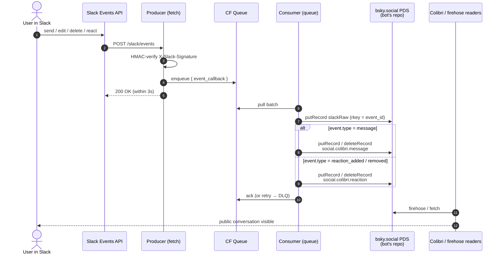
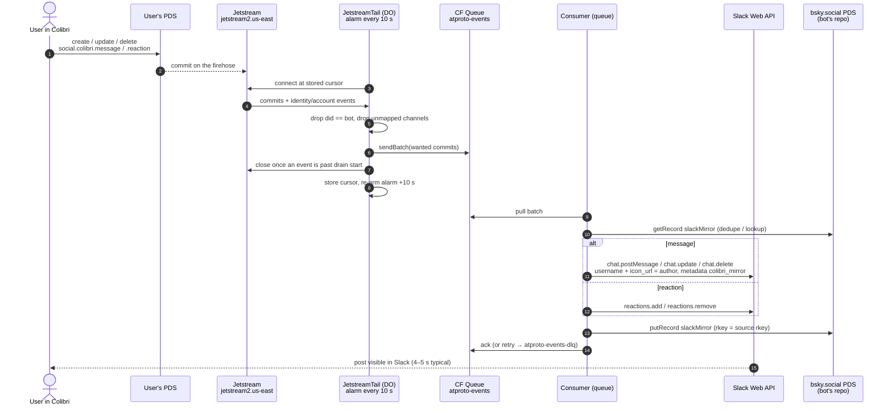

> **Status:** forward path (Slack → Colibri) live since 2026-05-31. Reverse path (Colibri → Slack) live since 2026-09-07 15:40Z — see [Reverse path](#reverse-path-colibri--slack-live). Bot identity [`@feelingofcomputing.bsky.social`](https://bsky.app/profile/feelingofcomputing.bsky.social) (`did:plc:4gcxakknd6hxtnhf33miwsob`). The community migrated on 2026-08-12 to its own identity `did:plc:dl3d3fftr4tk3yf3xqxouus7` on `colibri.social`; the bridge still writes the pre-migration channel rkeys, which Colibri resolves through `migratedFrom`. Auto-deployed on push.

Two-way sync between the FoC Slack workspace and the [Colibri](https://colibri.social) atproto network. Every bridged message, reaction, and attachment is a public record on the bot's bsky.social PDS; every raw Slack event is archived losslessly under a `com.feelingofcomputing.bridge.*` lexicon on the same repo. The bot authors messages into channels it does not own — the *inverse pattern* described under [Identity](#identity).

## What's live

Forward path (Slack → atproto), end-to-end:

- **Messages** — rich text → Colibri facets (bold, italic, strikethrough, code, link, channel); 2048-char cap; fallback to plain-text + URL regex for legacy non-`blocks` messages
- **Mentions** — `@user` resolves to a `social.colibri.richtext.facet#mention` against the user's claimed DID via the [in-source map](https://github.com/tomlarkworthy/slack-sync/blob/main/packages/worker/src/slack-to-did.ts); plain text fallback for unmapped users
- **Threaded replies** — Slack `thread_ts` → Colibri `parent`
- **Reactions** add + remove — deterministic per-emoji rkey on the target message. Since [`d757ec5`](https://github.com/tomlarkworthy/slack-sync/commit/d757ec5) (2026-09-07) written with the `parent` at-uri Colibri's lexicon requires; the 598 records before it carry only the older `targetMessage` field and do not render until rewritten; see [Known gaps](#known-gaps)
- **Message edits** — re-derive in place, `putRecord` overwrites, `edited: true` set per the message lexicon
- **Message deletes** — `deleteRecord` on the derived rkey
- **File attachments** — fetch `url_private` with bot token → `com.atproto.repo.uploadBlob` → reference in `attachments[]`; 5 MB cap, oversize gets a `[file 'name' too large]` placeholder in the message text
- **Lossless raw-event archive** — every `event_callback` envelope persisted to `com.feelingofcomputing.bridge.slackRaw` *before* derivation, keyed by `event_id` (idempotent on Slack redelivery)

Reverse path (atproto → Slack), end-to-end since 2026-09-07: messages, threaded replies, edits, deletes, reactions add + remove, posted as the bot with the Colibri author's name and avatar. Details under [Reverse path](#reverse-path-colibri--slack-live).

Not in scope:

- Private channels, DMs
- Per-Slack-user authorship — every bridged record is authored by the bot; the original speaker appears as `@user:` in the message text
- `slackRaw` backfill — historical days (pre-2026-05-31) have derived `social.colibri.message` + `social.colibri.reaction` only; the raw archive only exists for traffic the live bridge has seen

## Code

- **Repo**: [tomlarkworthy/slack-sync](https://github.com/tomlarkworthy/slack-sync) — Bun workspace monorepo
- **Worker**: [`packages/worker/src/index.ts`](https://github.com/tomlarkworthy/slack-sync/blob/main/packages/worker/src/index.ts) — single Cloudflare Worker; Slack receiver (`fetch`), both queue consumers (`queue`), cron (`scheduled`). Reverse half in [`reverse.ts`](https://github.com/tomlarkworthy/slack-sync/blob/main/packages/worker/src/reverse.ts), Jetstream producer in [`tail.ts`](https://github.com/tomlarkworthy/slack-sync/blob/main/packages/worker/src/tail.ts), channel map in [`channels.ts`](https://github.com/tomlarkworthy/slack-sync/blob/main/packages/worker/src/channels.ts), mrkdwn rendering in [`mrkdwn.ts`](https://github.com/tomlarkworthy/slack-sync/blob/main/packages/worker/src/mrkdwn.ts)
- **Tests**: `bun test packages/worker` — 30 tests on 2026-09-07, including [`test/echo.test.ts`](https://github.com/tomlarkworthy/slack-sync/blob/main/packages/worker/test/echo.test.ts), the loop guards in both directions
- **Backfill**: [`packages/backfill/src/index.ts`](https://github.com/tomlarkworthy/slack-sync/blob/main/packages/backfill/src/index.ts) — Bun CLI for re-publishing day-files from [Mariano's archive](https://github.com/marianoguerra/Feeling-of-Computing)
- **Slack app manifest**: [`manifest/slack-app.yaml`](https://github.com/tomlarkworthy/slack-sync/blob/main/manifest/slack-app.yaml)
- **Deploy**: Cloudflare Workers Builds, push-to-main → auto-deploy

## Architecture



Reverse path, live since 2026-09-07:



Notes on the live shape vs. the proposal that preceded it:

- **No D1 cache in v0.** The worker writes straight to the PDS and leans on deterministic rkeys + `putRecord` overwrite for idempotency. The D1 binding is reserved in `wrangler.toml` for v0.1+ if cache reads become useful.
- **slackRaw is the de-facto idempotency boundary.** rkey = sanitised Slack `event_id`; Slack redeliveries hit the same rkey and overwrite identical content.
- **Message rkey** = `tidFromSlackTs(message.ts)` — edits overwrite in place, deletes target the same rkey. The Slack timestamp is recoverable from the rkey (`tid >> 10` is Slack microseconds), which the reverse path relies on.
- **Reaction rkey** = `tidFromSlackTs(target.ts, hash10('react:' + emoji))` — same emoji on the same message always lands on the same record, so `reaction_removed` can `deleteRecord` without lookup.

## Lexicons

### Reused from Colibri

- [`social.colibri.message`](https://lexicon.garden/browse/social.colibri.message) — text, facets, createdAt, channel, parent, attachments, edited
- [`social.colibri.reaction`](https://lexicon.garden/browse/social.colibri.reaction) — emoji, targetMessage
- [`social.colibri.richtext.facet`](https://lexicon.garden/browse/social.colibri.richtext.facet) — bold, italic, strikethrough, code, link, mention, channel

The bridge writes `channel`, `parent` and `targetMessage` as bare rkeys. The current Colibri client writes at-uris, and names a reaction's target `parent`. See [Known gaps](#known-gaps) for the observed shapes side by side.

### Owned: `com.feelingofcomputing.bridge.*`

Namespace owned because FoC owns `feelingofcomputing.com/.org/.net`. The archive's lifetime, schema, and ownership belong to FoC, not Colibri — explicit boundary in the lexicon namespace de-risks Colibri lexicon churn (it has a substantial rework in flight on `feat/rework`) and de-risks Colibri disappearing entirely. If either happens, the raw archive on atproto is untouched and re-derivable.

#### Live in v0: `com.feelingofcomputing.bridge.slackRaw`

Lossless capture of the full `event_callback` envelope, written *before* any derivation.

```json
{
  "lexicon": 1,
  "id": "com.feelingofcomputing.bridge.slackRaw",
  "defs": {
    "main": {
      "type": "record",
      "key": "any",
      "record": {
        "type": "object",
        "required": ["slackChannelId", "slackTs", "payload", "capturedAt"],
        "properties": {
          "slackChannelId": { "type": "string" },
          "slackTs":        { "type": "string" },
          "eventType":      { "type": "string", "description": "Slack event type: message, message_changed, message_deleted, reaction_added, reaction_removed, etc." },
          "payload":        { "type": "unknown", "description": "Raw Slack event_callback envelope as received." },
          "capturedAt":     { "type": "string", "format": "datetime" }
        }
      }
    }
  }
}
```

rkey = sanitised Slack `event_id`. Slack file attachments referenced in `payload.files[]` are captured by URL only; the bytes are re-uploaded as atproto blobs by the derived `social.colibri.message` path (see [Code → Worker](https://github.com/tomlarkworthy/slack-sync/blob/main/packages/worker/src/index.ts)).

#### Live in v0: `com.feelingofcomputing.bridge.event`

The tail feed. Both halves append one pointer record per change to a FoC Colibri record, so a reader follows one collection on one repo rather than polling every member's.

Counted from the live repos on 2026-09-07, before the feed existed:

```
bot repo   social.colibri.message      1138
bot repo   social.colibri.reaction      615
native     messages, 5 member repos       44
native     reactions, 4 member repos      18
slackMirror rows                            8
community members                          23
```

A reader that knows only the bot repo sees the first two rows; the other 62 records are in the authors' own repos. `com.atproto.repo.listRecords` filters by repo and collection only — `channel` is a field inside the record — so there is no per-channel listing to subscribe to, and no single repo holds both directions.

```json
{
  "lexicon": 1,
  "id": "com.feelingofcomputing.bridge.event",
  "defs": {
    "main": {
      "type": "record",
      "key": "tid",
      "record": {
        "type": "object",
        "required": ["op", "subject", "via", "at"],
        "properties": {
          "op":      { "type": "string", "enum": ["create", "update", "delete"], "description": "What happened to `subject`, in Jetstream's vocabulary." },
          "subject": { "type": "string", "format": "at-uri", "description": "The social.colibri.* record. Any repo." },
          "cid":     { "type": "string", "description": "Record cid at the time of the event; absent for a delete." },
          "channel": { "type": "string", "description": "FoC channel as the pre-migration rkey the bridge writes." },
          "via":     { "type": "string", "enum": ["slack", "colibri"], "description": "Which half logged it." },
          "at":      { "type": "string", "format": "datetime", "description": "When the bridge observed the change; on a backfilled entry, the record's own time." },
          "backfill":{ "type": "boolean", "description": "Entry synthesised from a record that already existed, not logged as it happened." }
        }
      }
    }
  }
}
```

- **rkey is a TID minted at observation**, so `listRecords` rkey order is event order and a reader tails newest-first until it meets the last rkey it holds. Deliberately not the record's own creation time: a log is ordered by when things happened to it, and a native record's own TID was minted in someone else's repo.
- **Pointers, never content.** The body, facets and emoji stay in the `social.colibri.*` record. Pinned by a test that asserts the written keys are exactly `$type`, `at`, `op`, `subject`, `via` plus the two optional fields.
- **It does not replace `slackMirror`.** That map is keyed by the source rkey and rewritten in place, because Slack's `ts` cannot be chosen and the mapping must survive queue redelivery. Rewriting in place is what a log must not do: an edit leaves the rkey where it was and a delete removes it, so a newest-first tail sees neither. Both collections are kept and they answer different questions.
- **Logged before the Slack call**, so an unmapped channel, a missing scope or a trip to the DLQ cannot drop from the feed a record that exists on atproto. The cost is the duplicate a queue retry produces, so a reader must be idempotent on `subject`; merging records by uri already is.
- **A delete commit carries no record body**, so a native delete is logged only where a `slackMirror` row proves the record was FoC's. A record the bridge never mirrored cannot be told apart from another community's.
- **Backfilled by `packages/backfill/src/events.ts`.** One `create` per record that already existed, both directions, so a reader needs the feed and nothing else. Dry run by default; `--live` needs `BSKY_HANDLE` and `BSKY_APP_PASSWORD`. Counted 2026-09-07:

  ```
  messages read        1186
  reactions read        635
  skipped, not FoC's     25   member repos hold their other communities too
  reactions w/o channel  13   target message no longer exists; channel omitted
  to write             1785
  ```

  A backfilled entry's rkey comes from the **subject's** TID, not from now, so the entries interleave in content order and all sort before the ones the live bridge has minted since deploy. A tailer's "stop at the last rkey I hold" therefore keeps working across the switch-over. `backfill: true` and `at` = the record's own time say the entry was reconstructed rather than observed.

  A create costs 3 of the PDS's 5000 points per hour, so `--limit` defaults to 1600 and the run stops there. Re-running resumes: every subject already in the collection is skipped.

## Maintenance

The bridge's per-deployment configuration lives in source, not in lexicon records. Two maps:

- **Slack channel → Colibri channel rkey** — [`packages/worker/src/channels.ts`](https://github.com/tomlarkworthy/slack-sync/blob/main/packages/worker/src/channels.ts) (`CHANNELS`, both rkeys per channel, shared by both directions since `a5e808d`) for the live worker, and `tools/slack-to-colibri-channel.json` for the backfill CLI. The two must agree.
- **Slack user id → claimed atproto DID** — [`packages/worker/src/slack-to-did.ts`](https://github.com/tomlarkworthy/slack-sync/blob/main/packages/worker/src/slack-to-did.ts) for the live worker, `tools/slack-to-did.json` for the backfill. The two must agree.

Since the 2026-08-12 migration every channel has two rkeys. `CHANNEL_MAP` still holds the pre-migration ones; the migrated channel records carry `migratedFrom` pointing back at them. Read from `did:plc:dl3d3fftr4tk3yf3xqxouus7` on 2026-09-07:

```
Slack id      name                pre-migration rkey       migrated rkey
              (owner did:plc:j7nm3lrd5h7fm3sfhcv3lhfv)     (did:plc:dl3d3fftr4tk3yf3xqxouus7)
CGMJ7323Z     announcements       3mn5tjsyuvt2t            3msvih7djjrdp
C01932BJGE8   present-company     3mn5tlwafrh2k            3msvih7djjqmu
C5U3SEW6A     linking-together    3mn5tle5l7c2z            3msvih7djjpb2
CEXED56UR     administrivia       3mn5tjjdnai2t            3msvih7djjo7j
C050QK4917D   of-ai               3mn5tlntcfa2f            3msvih7djjm5k
C5T9GPWFL     thinking-together   3mn5tmllqd72d            3msvih7djjlku
C0B7BGKT8MP   test-01             3mn5tckh3ij24            3msvih7djjklu
C03RR0W5DGC   devlog-together     3mn5tk5v4yr2s            3msvih7djji3e
C0120A3L30R   two-minute-week     3mn5tn53kwy2w            3msvih7djjha6
CC2JRGVLK     introduce-yourself  3mn5tkvfo2j2s            3msvih7djjfxt
CCL5VVBAN     share-your-work     3mn5tmbyexz27            3msvih7djjbh2
```

To add a new bridged channel: create the `social.colibri.channel` record on the community identity, hand the rkey to the bridge maintainer, who edits both files, commits, and pushes — Cloudflare Workers Builds redeploys the worker automatically on push. Also `/invite @focbridge` in the Slack channel: the bot has to be a member both to receive its events and to post into it. A channel created after the migration has only a migrated-style rkey; whether the bot may reference it as a bare rkey or must use the at-uri form is untested.

To map a new user to their DID: get their bsky handle, resolve to a DID with `com.atproto.identity.resolveHandle`, add the entry to both files, commit, push.

## Identity

Three DIDs are involved since the migration:

- **Original community owner** (`did:plc:j7nm3lrd5h7fm3sfhcv3lhfv`) created the community (`social.colibri.community/3mn5nudqvhs2x`) and every channel under it on 2026-05-31. That community record now carries `migratedTo`.
- **Community identity** (`did:plc:dl3d3fftr4tk3yf3xqxouus7`, handle `c-3msvih5zj4kuk.colibri.social`, PDS `colibri.social`) holds the community as `social.colibri.community/self` with `migratedFrom`, `appview: did:web:api.colibri.social`, and 11 channels each with `migratedFrom`. Created 2026-08-12 (the TIDs decode to 15:54 UTC that day).
- **Bot** (`did:plc:4gcxakknd6hxtnhf33miwsob`, handle `feelingofcomputing.bsky.social`) authors every bridged message. Its `social.colibri.membership` record still names the original community URI; the bridged messages render in the migrated community regardless, so either the appview follows `migratedFrom` for membership too or membership is not enforced for writes. Not verified which.

Attribution for the original Slack speaker lives in the message text as `@user: ...` — rendered as a Colibri mention facet once the speaker has claimed a DID.

### Authorship is immutable

The author of an atproto record is the DID of the repo it lives on. `putRecord` edits content; `deleteRecord` removes a record; nothing reassigns authorship. All bridged messages stay authored by the bot. Retroactive delete + republish would change the at-uri, breaking links, threads, and firehose state, so we don't.

### Channels live in the bot's community

The Colibri appview, as read in May 2026, hard-coupled channel ownership to community ownership by author DID. From `jetstream.rs`:

```rust
let community_uri =
    format!("at://{}/social.colibri.community/{}", did, record.community);
```

The community URI for an indexed channel is constructed from the **channel record's author DID** plus the channel's `community` rkey field. A bot-authored channel record can only resolve to a community on the bot's own repo; the appview will not index a bot-authored channel into a community owned by a different DID.

v0 went with the **inverse pattern**: the community owner pre-creates the community + every bridged channel under their own DID; the bot only authors messages referencing the channel rkeys. The bot does *not* own the community, channels, or categories. Trade-off: one-time manual setup by the community owner and an ongoing convention that they add a Colibri channel whenever a new Slack channel should be bridged — but the bot's repo stays a pure archival identity, and ownership of the community is decoupled from the bridge's operational lifetime.

The migration moved the community onto a DID of its own rather than a person's. That is a different answer to the same coupling: the community identity owns its channels, and people (and the bot) write into them. Observed from the records, not from the appview source.

### Per-message avatar / displayName

Avatar and displayName come from the actor's profile record — one per DID. With one bot DID, every bridged message renders with the bot's avatar regardless of who sent it on Slack. The Colibri message lexicon has no override fields, so attribution lives in the message text body. This is the biggest visual gap and it isn't fixable without either upstream changes to the Colibri lexicon or per-user atproto identities (rejected: bsky.social account-creation rate limits and creating DIDs for users without their consent).

## Operational notes

- **Coverage.** The bot repo held 1121 `social.colibri.message` records on 2026-09-07: 265 in May 2026, 310 June, 222 July, 254 August, 69 September, one stray from 2025-03. May is archive backfill (deterministic rkeys, so re-running a day overwrites in place); June onward is live traffic with a `slackRaw` record behind each message.
- **Latency.** From `slackRaw` (`capturedAt` minus Slack's `event_time`), 1721 events 2026-05-31 → 2026-07-20: p50 5.0 s, p90 6.6 s, p99 10.8 s, flat week over week. That is time to capture on the bot repo, stamped before blob uploads and the message `putRecord`, not time to visible in Colibri.
- **6 Slack channels are not bridged** (`#of-end-user-programming`, `#of-graphics`, `#of-music`, `#of-logic-programming`, `#reading-together`, `#of-functional-programming`; ~4600 messages of historical traffic combined, counted 2026-06-01). The backfill hard-fails on any day that references them. To bridge them, create the corresponding Colibri channels and update the maps in *Maintenance*.
- **Lexicon records show "not validated"** in atproto-browser. `com.feelingofcomputing.bridge.slackRaw` isn't published anywhere yet; doing so would require either a `_lexicon` TXT record on `feelingofcomputing.com` or a `com.atproto.lexicon.schema` record. The bridge functions either way — validation is purely a tooling/discoverability signal.

## Known gaps

Things observably missing from v0. Listed as facts, not commitments.

- **Record shapes differ from the native client.** Tom's first native posts into the FoC channels (2026-09-07, a message, a reply and a reaction from `did:plc:j7nm3lrd5h7fm3sfhcv3lhfv`) against the bridge's output:

  ```
  field                    bridge writes                          native client writes
  message.channel          "3mn5tk5v4yr2s"  (bare, pre-migration) "at://did:plc:dl3d3fftr4tk3yf3xqxouus7/social.colibri.channel/3msvih7djji3e"
  message.parent           "3muc5hdq7vl22"  (bare, thread root)   "at://did:plc:…/social.colibri.message/3munacbuvuz22"  (direct parent)
  message.attachments      always present, [] when none           absent
  message.facets[].index   {byteStart, byteEnd}                   {$type: "app.bsky.richtext.facet#byteSlice", byteStart, byteEnd}
  facet features           bold italic strike code link mention   also list {ordered}
  reaction target          targetMessage: "<bare rkey>"           parent: "at://did/social.colibri.message/rkey"
  ```

  Bridged messages render, so the bare `channel` is tolerated (the lexicon on Colibri `main` says `format: at-uri`; `parent` it says is a `record-key`, so there the bridge is the conformant one). **Bridged reactions do not render**: Colibri's lexicon requires `emoji` + `parent` (at-uri), `targetMessage` no longer exists in its source, and Tom saw no reactions on a message that has two bridged records (`…/3muc5hdq7vl22`, ❤️ from three Slack users and 😍 from one). A native reaction on a bridged message does render. Fixed for new reactions in `d757ec5` (worker and backfill write `parent` as the message at-uri, keeping `targetMessage` for existing readers); the 598 records written before it still need a rkey-preserving `putRecord` sweep.
- **Per-record author override on Colibri's lexicon.** Every bridged message and reaction renders as the bot. Optional `displayAuthor: { name, avatar? }` on `social.colibri.message` and `social.colibri.reaction` would be the cleanest fix; would also unblock proper reaction multi-reactor counts.
- **Thread rendering.** Slack's threads flatten to sibling rows in Colibri because Colibri's UI is Discourse-flat — a 30-reply Slack thread becomes 30 top-level rows referencing the same `parent_message`. Colibri's `feat/rework` branch still renders flat.
- **Cross-repo channel ownership in Colibri's appview.** The appview hard-codes `community_uri = at://{channel_author}/social.colibri.community/{rkey}`, so a single DID has to own both the community and every channel under it. The migration to a community DID is Colibri's answer; the bridge's remains "channels pre-created, bot references rkeys".
- **Quote facet.** Slack `rich_text_quote` blocks render as `> `-prefixed plain text because Colibri's facet feature set has no quote.
- **TID-on-rkey monotonicity assurance from Colibri.** `social.colibri.message` uses `key: "tid"`. bsky.social tolerates non-monotonic TIDs (without which backfill of old Slack history would 409 against live messages). A PDS that strictly enforced monotonicity would break the bridge; a one-line assurance in the lexicon docs or a switch to `key: "any"` would lock this in.

## Reverse path (Colibri → Slack), live

Built 2026-09-07 in four slack-sync commits: [`a5e808d`](https://github.com/tomlarkworthy/slack-sync/commit/a5e808d) consumer, hand-fed; [`aadfe9c`](https://github.com/tomlarkworthy/slack-sync/commit/aadfe9c) Jetstream tail; [`03298eb`](https://github.com/tomlarkworthy/slack-sync/commit/03298eb) byline dropped in favour of the author as poster; [`18152fb`](https://github.com/tomlarkworthy/slack-sync/commit/18152fb) Slack replies/reactions on a mirrored post target the Colibri original. Design record with the probes behind each decision: `plan/colibri-to-slack-bridge.md` in [lopecode-dev](https://github.com/tomlarkworthy/lopecode-dev).

**Why.** Until 2026-09-07 every message in the FoC channels was bridge-authored. The first native posts (a message, a reply to a bridged message, a reaction) were invisible in Slack.

### Identifiers

Everything a maintainer needs to find the pieces. Read from the live systems on 2026-09-07.

```
Slack
  workspace (team_id)           T5TCAFTA9
  app "FoC Bridge"              A0B6U3WE1RD        https://api.slack.com/apps/A0B6U3WE1RD
  bot user                      U0B7685PHGD        the forward guard keys on this
  bot scopes                    channels:history channels:read groups:history groups:read
                                users:read users:read.email emoji:read files:read reactions:read
                                chat:write chat:write.customize reactions:write   (added 2026-09-07)
  event subscriptions           message.channels message.groups reaction_added reaction_removed  (unchanged)
  post metadata                 event_type "colibri_mirror", event_payload {uri, cid}
  channels                      the 11 ids in the Maintenance table

atproto
  bot                           did:plc:4gcxakknd6hxtnhf33miwsob   @feelingofcomputing.bsky.social
  bot PDS                       https://jellybaby.us-east.host.bsky.network  (entryway https://bsky.social)
  community (since 2026-08-12)  did:plc:dl3d3fftr4tk3yf3xqxouus7   c-3msvih5zj4kuk.colibri.social, PDS colibri.social
  pre-migration owner           did:plc:j7nm3lrd5h7fm3sfhcv3lhfv   Tom
  appview                       did:web:api.colibri.social
  collections written           social.colibri.message  social.colibri.reaction
                                com.feelingofcomputing.bridge.slackRaw   (forward archive, rkey = event_id)
                                com.feelingofcomputing.bridge.slackMirror (reverse index, rkey = source rkey)
                                com.feelingofcomputing.bridge.event      (tail feed, rkey = TID at observation)
  firehose                      wss://jetstream2.us-east.bsky.network/subscribe
                                ?wantedCollections=social.colibri.message&wantedCollections=social.colibri.reaction

Cloudflare (account subdomain endpointservices)
  worker                        slack-sync-bridge   https://slack-sync-bridge.endpointservices.workers.dev
  queues                        slack-events / slack-events-dlq        (forward)
                                atproto-events / atproto-events-dlq    (reverse)
  durable object                class JetstreamTail, one instance named "tail" (migration tag v1, sqlite)
  cron                          */1 * * * *   re-arms the tail's alarm if lost
  secrets                       SLACK_SIGNING_SECRET SLACK_BOT_TOKEN BSKY_HANDLE BSKY_APP_PASSWORD INJECT_TOKEN
  routes                        POST /slack/events   GET /health
                                POST /atproto/inject          bearer INJECT_TOKEN, hand-feed one commit
                                GET /tail/status  POST /tail/start  POST /tail/stop   bearer INJECT_TOKEN
  deploy                        Workers Builds on push to main of tomlarkworthy/slack-sync
```

### Loop safety

Two writers, one per direction, and each direction drops the other writer's account before touching a network. Pinned by `test/echo.test.ts` (30 tests pass, 2026-09-07).

```
path                                            guard                                             where
Slack human msg  → bot Colibri record           tail and consumer skip did == bot DID             tail.ts wantEvent, reverse.ts handleAtprotoEvent
Colibri human msg → bot Slack post              forward skips user == U0B7685PHGD, or bot_id,     index.ts isSelfSlackEvent
                                                or subtype bot_message, or metadata colibri_mirror
Slack human reaction → bot Colibri reaction     same as row 1
Colibri human reaction → bot Slack reaction     forward skips reaction user == bot                index.ts isSelfSlackEvent
bot chat.update → message_changed               judged on the nested message                      same
bot chat.delete → message_deleted               judged on previous_message                        same
bot reactions.remove → reaction_removed         user == bot                                       same
```

Checked live, not only in tests: after the first mirrored post (Slack ts `1788794724.510389`) the bot repo had no `social.colibri.message` at `tidFromSlackTs` of that ts, and no bot reaction records at the rkeys the two mirrored reactions would have produced. Human replies and reactions on a bot post are not self events and still flow, see *Threads and reactions*.

### Source of events

Jetstream filters by collection, not community, so every Colibri room on the network arrives and the channel match drops the rest. `identity` and `account` events keep flowing regardless of the filter, which gives a consumer a clock: an event whose `time_us` is past the moment the drain started means it is caught up.

The producer is a Durable Object (`JetstreamTail`) with an alarm every 10 s. Each alarm opens the socket at the stored cursor, forwards the wanted commits in batches, closes once caught up or after 8 s, stores the last `time_us`, re-arms. Started 2026-09-07 15:40:03Z; the first 50 s of `/tail/status`:

```
15:40:15Z  drains 2  lastDrainMs  334  seen  7  caughtUp true
15:40:27Z  drains 3  lastDrainMs 1425  seen 10  caughtUp true
15:40:40Z  drains 4  lastDrainMs 3265  seen  8  caughtUp true
15:40:52Z  drains 5  lastDrainMs 1066  seen  5  caughtUp true
```

Replay check before starting it: the same filter run from a cursor at 13:04Z (`scripts/tail-smoke.ts`) caught up in 76 s over 6544 events and passed exactly the four native records that had been injected by hand that afternoon, nothing from the bot repo.

Latency, record TID to `postedAt` on the mirror record, the four tail-driven posts of 2026-09-07:

```
3muwtvj3e2cww  15:42:24.7 -> 15:42:29.1   4.4 s
3muwuehgrwsqe  15:50:46.3 -> 15:51:03.5  17.1 s   (worker redeploying, 03298eb)
3muwunr2lns66  15:55:58.4 -> 15:56:03.2   4.8 s
3muwutt35icww  15:59:21.8 -> 15:59:27.0   5.2 s
```

Rejected alternatives: a persistent socket (same latency minus the alarm wait, but ~82% of the Durable Object duration allowance versus ~16% for the alarm drain, priced 2026-09-07); the existing contrail cron indexer (~30 s median, kept for the viewer instead). The alarm drain is one line from a persistent socket if a sub-second tail is ever wanted.

### Consumer

Per commit, in order (`reverse.ts`):

1. `did == bot DID` → skip. Collection not message/reaction → skip.
2. Message: resolve `channel` through `channelForRef`, which accepts the bare pre-migration rkey, the pre-migration at-uri and the migrated at-uri. Unmapped → skip.
3. Dedupe against `com.feelingofcomputing.bridge.slackMirror` on the bot repo, rkey = the source record's rkey. Same `sourceCid` → already posted. Slack's `ts` cannot be chosen, so the mapping is stored rather than derived; this is what makes queue redelivery and cursor replay safe.
4. Render, post, then `putRecord` the mirror.

```json
{
  "lexicon": 1,
  "id": "com.feelingofcomputing.bridge.slackMirror",
  "defs": {
    "main": {
      "type": "record",
      "key": "any",
      "record": {
        "type": "object",
        "required": ["source", "slackChannelId", "slackTs", "postedAt"],
        "properties": {
          "source":         { "type": "string", "format": "at-uri", "description": "The native record this Slack post or reaction mirrors." },
          "sourceCid":      { "type": "string" },
          "slackChannelId": { "type": "string" },
          "slackTs":        { "type": "string" },
          "slackThreadTs":  { "type": "string", "description": "Messages: the Slack thread root (own ts when top-level)." },
          "emojiName":      { "type": "string", "description": "Reactions: the Slack short name that was added." },
          "postedAt":       { "type": "string", "format": "datetime" }
        }
      }
    }
  }
}
```

`update` commits → `chat.update` on the mirror's `slackTs`. `delete` → `chat.delete`, then delete the mirror. Reactions → `reactions.add` / `reactions.remove` with the Slack short name (the forward path's name→unicode table inverted; a custom `:name:` passes through); `already_reacted`, `no_reaction`, `message_not_found` are tolerated.

**Rendering.** The post carries the author as `username` and `icon_url` (`chat:write.customize`), name from the Bluesky profile, falling back to the handle in the DID document. The text is the body alone; the `@name: ` byline is prepended only if the customize scope is missing (`missing_scope` fallback). Mention facets whose DID is in the Slack-user map render as `<@U…>`; links as `<url|text>`; bold, italic, strikethrough, code as mrkdwn; `&`, `<`, `>` escaped. Attachments as `com.atproto.sync.getBlob` links on the author's PDS; `unfurl_links` and `unfurl_media` off.

### Threads and reactions

A reply or reaction crosses the identity mapping in whichever direction it travels:

```
direction   target author    how the other side's id is found
S → C       Slack human      tidFromSlackTs(ts)                                              unchanged
S → C       bot post         parent_user_id / item_user == bot → conversations.replies with   18152fb
                             include_all_metadata → colibri_mirror uri → parent = that at-uri
C → S       bridged message  tid >> 10 → Slack ts; channel from the record; its own `parent`  verified 15:25Z on Tom's reply
                             is the Slack root (one hop)
C → S       native message   slackMirror lookup by rkey → slackTs / slackThreadTs
```

Colibri threads nest (a native reply points at its direct parent, which may itself be a reply) while Slack has one level under a root `thread_ts`, so the reverse side walks `parent` until it reaches a bridged message or a mirrored one. Tom's reply `3muwlasrtbcww` took two hops to land in thread `1788084452.267889`.

The second row was the last gap: a 🎉 added in Slack to the first mirrored post before `18152fb` produced reaction record `3muwsx44upptv` whose `parent` names a bot-repo message that does not exist. Removing and re-adding the reaction rewrites it under the new code.

### Slack knowledge the reverse path depends on

- **Scopes.** `chat:write` (post, update, delete own messages), `chat:write.customize` (per-post `username` / `icon_url`), `reactions:write`. A scope change is not live until the app is reinstalled; the first live inject on 2026-09-07 failed with `missing_scope` for exactly that reason and retried into `atproto-events-dlq`. Reinstalling kept the same bot token.
- **The bot must be a member of a channel to post in it**, the same membership the forward path needs to receive `message.channels` events.
- **The bot's own posts come back as events** through the existing subscription, with `user` = the bot user id, and `metadata` intact. A `chat.update` comes back as `message_changed` with the nested `message`, a `chat.delete` as `message_deleted` with `previous_message`.
- **Events name the target's author.** Thread replies carry `parent_user_id`; `reaction_added` / `reaction_removed` carry `item_user`. The forward side gates its one `conversations.replies` call on them.
- **Message metadata** (`metadata: { event_type, event_payload }`) is invisible in the UI and returned by `conversations.replies` with `include_all_metadata=true`.
- **Rate limits** ([docs.slack.dev](https://docs.slack.dev/apis/web-api/rate-limits), read 2026-09-07): one message per second per channel; `reactions.add`, `chat.update`, `chat.delete`, `conversations.replies` Tier 3, 50+ per minute. A 429 throws and the queue retries.
- **Text.** Slack recommends 4000 characters; Colibri messages are capped at 2048. mrkdwn is not Markdown: `*bold*`, `_italic_`, `~strike~`, `` `code` ``, links as `<url|text>`, and `&`, `<`, `>` must be entity-escaped.
- **Reactions take short names, not characters.** `reactions.add` wants `name=heart`, never `❤️`.
- **A bot cannot post as a person.** Everything the reverse path writes appears as the app with an APP badge, however `username` is customised. That is what the forward guard keys on.

### Operating it

- `GET /tail/status` (bearer `INJECT_TOKEN`) returns `enabled`, `cursorUs`, last drain time/duration/size, `lastCaughtUp`, `lastError`, next `alarmAt`. `drains` climbing by 6 a minute with `lastCaughtUp: true` is healthy.
- `POST /tail/stop` disconnects the reverse path without a deploy; `POST /tail/start` resumes from the stored cursor, so nothing posted in between is lost (Jetstream replays; the mirror records dedupe).
- A poisoned event ends in `atproto-events-dlq` after 5 retries. Purge from the dashboard (Queues → the DLQ → Settings) or `npx wrangler@4 queues purge atproto-events-dlq`; the repo pins wrangler 3, which has no `purge`.
- `bun scripts/inject.ts at://did/collection/rkey` feeds one record by hand; `bun scripts/tail-smoke.ts [cursor_us] [budget_ms]` runs one drain locally with the production filter.

### Open

- The bot's `social.colibri.membership` record still points at the pre-migration community. Tom's own posts render with no membership record for the FoC community, so membership may not gate writes.
- Reactions and deletes are forwarded network-wide (they carry no channel), each costing one queue op and one `getRecord` on the bot repo before being dropped as unmapped. Colibri-wide volume was 9 commits in a day of probing, so this was left as is.

## Prior art

- **[Bridgy Fed](https://fed.brid.gy)** — ActivityPub ↔ atproto. Not directly applicable (Slack isn't ActivityPub) but informs the rejected per-user ghost-DID approach.
- **[matrix-appservice-slack](https://github.com/matrix-org/matrix-appservice-slack)** — closest sibling. Same Slack-webhook → ghost-users → federated-protocol shape, targeting Matrix.
- **Mariano's `scripts/dump-history.js` + `foc-server`** ([repo](https://github.com/marianoguerra/Feeling-of-Computing)) — the existing FoC pipeline pulls `conversations.history` + `conversations.replies` via Slack REST on a weekly cadence, writes JSON to `history/YYYY/MM/DD{,.replies}.json`, indexes into LanceDB with sentence-transformer embeddings, serves search via a Rust `axum` binary on Ubuntu under systemd behind nginx. Pull, not push; ingest-and-reindex, not bridge. The bridge's `slackRaw` lexicon is the atproto-native analog of those `history/*.json` dumps — same archival role, public over the firehose instead of `git push`. The backfill CLI consumes these JSON dumps directly.

## Use it in the browser

- I did the following to successfully use the FoC bridge
- Go to https://colibri.social/app login with *sky handle
- then go to:
- https://colibri.social/app/c/did:plc:dl3d3fftr4tk3yf3xqxouus7/text/3msvih7djji3e
- or use invite: https://colibri.social/invite/guSK9oNF2vcm5DTg

## Related

- [[Projects]] — Colibri and FoC are both listed.
- [[slack]] — the community's history of discussing a move off Slack.
- [Colibri lexicons](https://lexicon.garden/browse/social.colibri)
- [Colibri source](https://github.com/colibri-social/colibri.social)
- [FoC repo](https://github.com/marianoguerra/Feeling-of-Computing)
